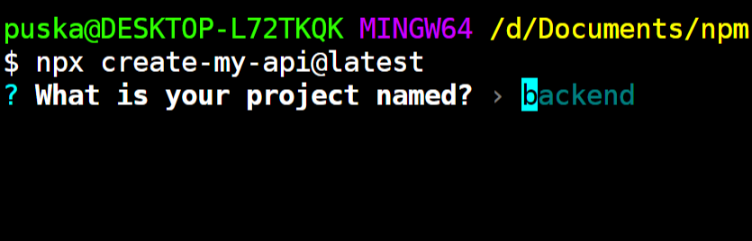
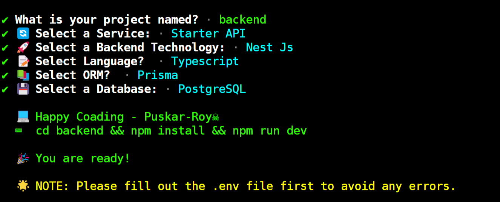

<a name="readme-top"></a>

<br />
<div align="center">
  <a href="https://github.com/Puskar-Roy/create-my-api">
    
    
  </a>

  <h1 align="center">Create My API ✨</h1> 
  <p align="center">
    Welcome to the Create My API CLI your go-to tool and API Library for rapidly setting up production-ready API projects with ease! Whether you're a seasoned developer or just getting started, our API Library and CLI provides a streamlined 
    experience for creating RESTful APIs using various backend technologies and database combinations.
    <br />
    <a href="https://github.com/Puskar-Roy/create-my-api"><strong>Explore the docs »</strong></a>
    <br />
    <br />
    <a href="https://www.npmjs.com/package/create-my-api">View Demo</a>
    ·
    <a href="https://github.com/Puskar-Roy/create-my-api/issues">Report Bug</a>
    ·
    <a href="https://github.com/Puskar-Roy/create-my-api/issues">Request Feature</a>
  </p>
</div>


## ⚙️ Installation

### Run This Command 🚀

```bash
   npx create-my-api@latest
```

 - 


### Then Chosse a Configuration, Thats it ⌨️


 - **Express Js, Javascript, Mongo DB**

 - 

 - **Nest Js, Typescript, Prisma, Postgre SQL**

 - 

- **Existing E-learning Platform API**
 - 


 *__Note - You Can Check [Guidebook](./docs/md/Guidebook.md) for more details__*


## 🛠️ Prerequisites

- [Node.js](https://nodejs.org/) installed on your machine 🟩
- [Git](https://git-scm.com/) installed on your machine 🐙


## 📚 API Starter Templates

__*Create My-API*__ offers a variety of starter templates to get your project up and running quickly. Here are some of the available templates:

- `Express-Typescript-with-Mongodb`
- `Express-Javascript-with-Mongodb`
- `Express-Typescript-with-Postgresql`
- `Express-Javascript-with-Postgresql`
- `Nestjs-Typescript-with-Postgresql`


## 📂 Existing APIs

In addition to starter templates, we also provide __Existing APIs__ that you can integrate into your projects:


- `Attendance Portal`
- `E-learning Platform`
- `2FA Auth`
- `Real-time Chat API`

## 🛠️ Tech Stack
__Create My-API supports a variety of technologies and databases:__


<div align="center">


### Languages


### Frameworks


### Databases


### Services


</div>


## ❤️ Contributing

We welcome contributions to Create My-API! 

To get started, please check out the [CONTRIBUTING.md](./CONTRIBUTING.md) file for guidelines on how to contribute. Here are some key points:

- __Create a new branch from your fork for any changes you make.__

- __If you're adding a new API, please add it inside the `packages/APIs` directory.__

- __If you're enhancing existing `templates` or APIs, please work inside the `packages/APIs` or templates directories.__

- __If you're working on the documentation website, please work inside the `apps` directory *(client for Next.js frontend and server for Node.js Express backend).*__

__*Note: If contributions do not follow the guidelines specified in the [CONTRIBUTING.md](./CONTRIBUTING.md) file, the pull request will not be accepted ❌.*__


<h2 align = "center">Contributors of create-my-api 🚀</h2>
<div align = "center">
<a href="https://github.com/Puskar-Roy/create-my-api/graphs/contributors">
  
</a>
</div>


## 📬 Contact

If you have any questions, feel free to open an issue or reach out to the project [maintainer](https://www.linkedin.com/in/puskar-roy/).

__Please ⭐ the repository for show some love!__

### Puskar Roy 🖋️


<div align="right">
  <a href="#readme-top">back to top</a>
</div>